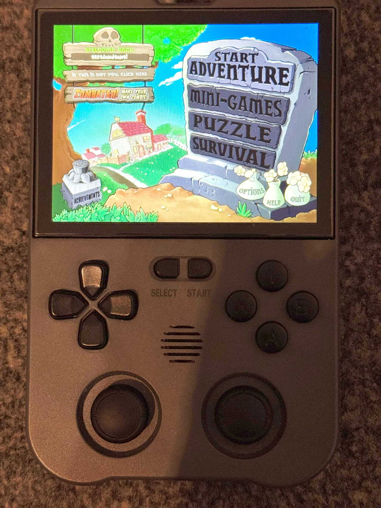

# Plants vs Zombies Portable (PortMaster-Only Package)

Portable package layout and launcher for **Plants vs Zombies**.

This repository is intended only for **PortMaster** on Linux-based retro gaming devices and firmware (for example AmberELEC and ROCKNIX), plus related handheld distributions compatible with PortMaster.

> This repository does **NOT** contain any copyrighted game assets (such as images, music, or fonts) owned by PopCap Games or Electronic Arts. Users must provide their own `main.pak` and `properties/` folder from a **legally purchased copy** of Plants vs. Zombies: GOTY Edition.



## Supported Environment

| Environment | Status | Notes |
| --- | --- | --- |
| PortMaster on Linux-based retro devices | Supported | Primary target |
| AmberELEC (with PortMaster) | Supported | Works as PortMaster package |
| ROCKNIX (with PortMaster) | Supported | Works as PortMaster package |

Notes:
- The included runtime binary is `PvZ-Portable/pvz_portable.aarch64`.
- This package is not a general multi-platform release.

## Repository Layout

```text
.
├── Plants vs Zombies Porable.sh
└── PvZ-Portable/
    ├── pvz_portable.aarch64
    ├── main.pak
    ├── libs.aarch64/
    ├── gl4es/
    ├── properties/
    ├── gptokeyb.ini
    ├── gameinfo.xml
    └── port.json
```

## Run on Linux (ARM64 / PortMaster)

1. Ensure the project is at the expected port path in your PortMaster environment:
   - `/$directory/ports/PvZ-Portable`
2. Make the launcher executable:

```bash
chmod +x "Plants vs Zombies Porable.sh"
```

3. Start the game:

```bash
./"Plants vs Zombies Porable.sh"
```

The launcher will:
- resolve your PortMaster control directory,
- set OpenGL compatibility libraries (`gl4es`) when needed,
- export `LD_LIBRARY_PATH` for bundled ARM64 shared libraries,
- map controls via `gptokeyb.ini`,
- write runtime logs to `PvZ-Portable/log.txt`.

## Scope

This project is scoped to PortMaster packaging and runtime on supported Linux retro-console environments only.

## Controls

Default gamepad-to-mouse mapping is in `PvZ-Portable/gptokeyb.ini`:
- `A` -> Left click
- `B` -> Right click
- D-pad / Left stick -> Mouse movement

You can tune pointer speed with `mouse_scale`.

## Troubleshooting

### Black screen or immediate exit
- Check `PvZ-Portable/log.txt` for loader/runtime errors.
- Verify required shared libs exist in `PvZ-Portable/libs.aarch64/`.

### GL/graphics issues on handheld Linux
- Confirm `gl4es/libGL.so.1` and `gl4es/libEGL.so.1` are present.
- Re-test with your current PortMaster runtime files.

### Input does not work
- Verify `gptokeyb` is available in your PortMaster setup.
- Adjust bindings in `PvZ-Portable/gptokeyb.ini`.

## Legal

This repository is a portable packaging/runtime project and does not distribute proprietary Plants vs. Zombies game content. Make sure you have the legal right to use any game data you deploy with it.
